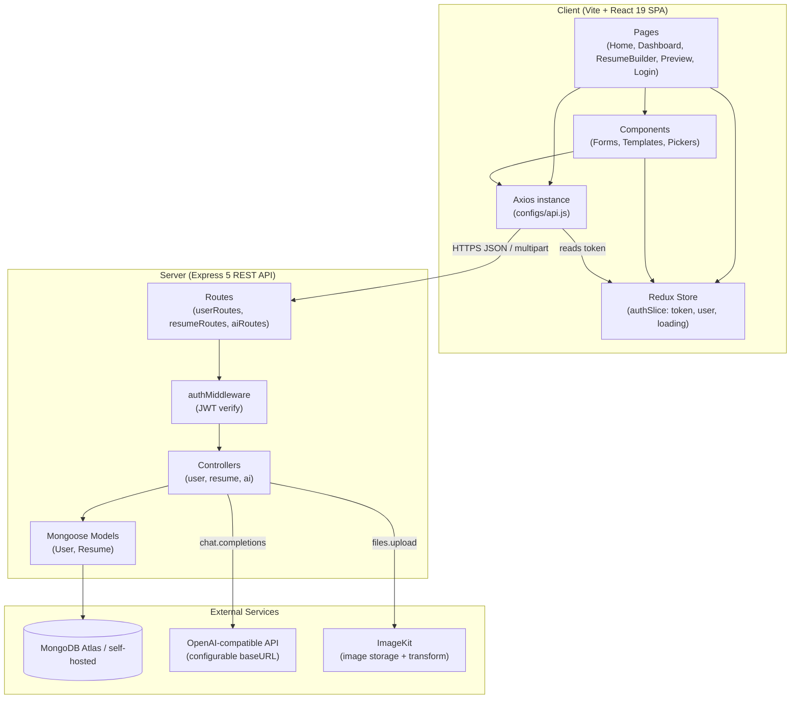
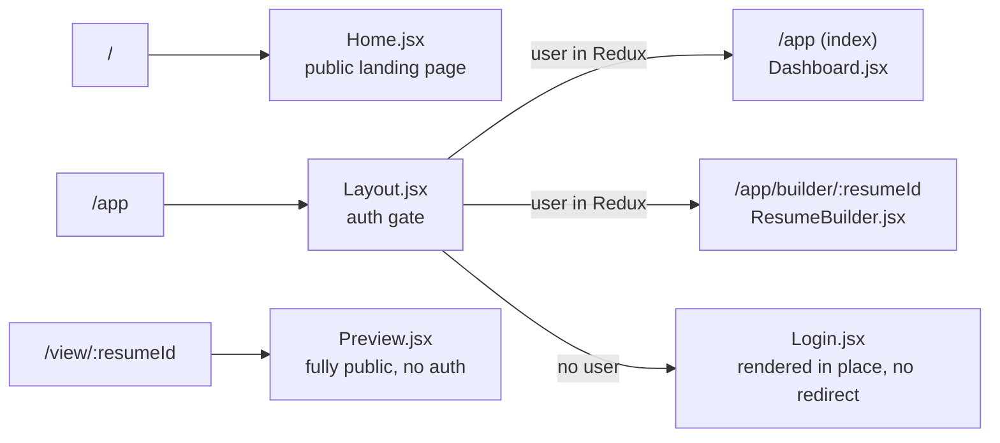
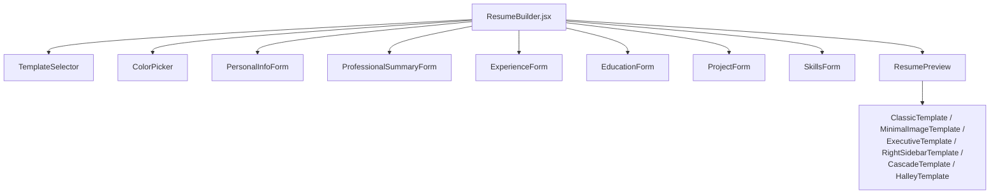
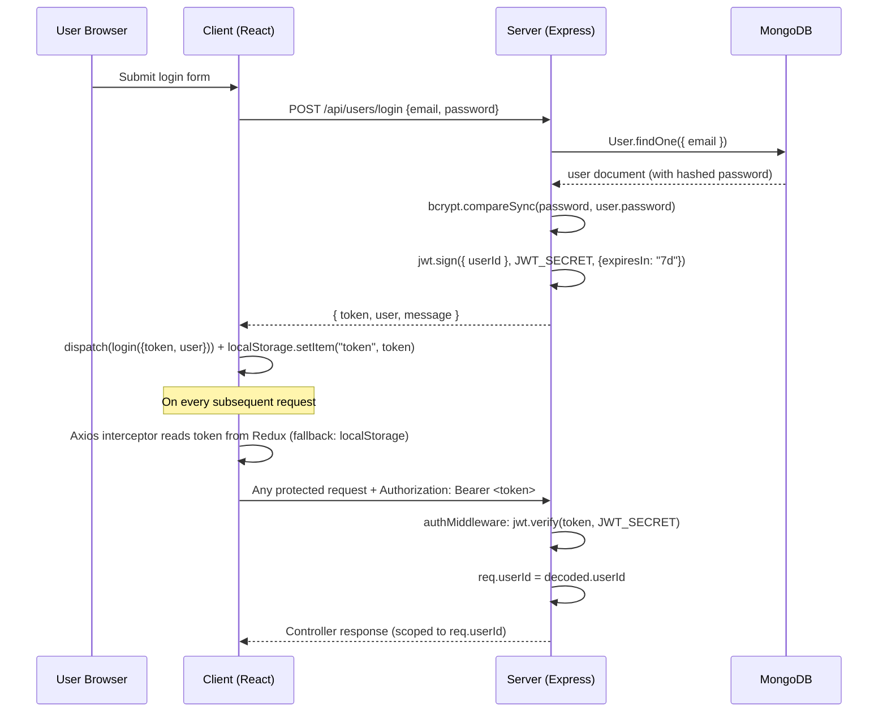
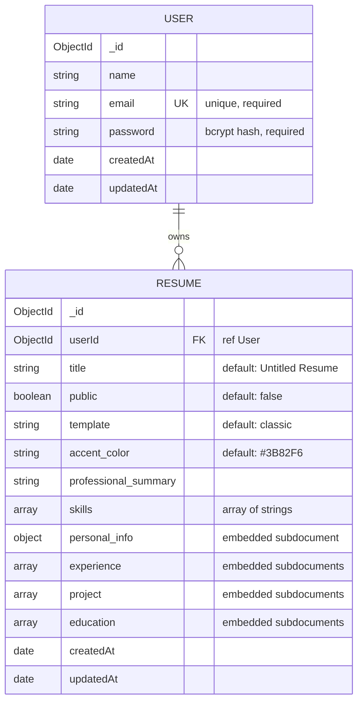
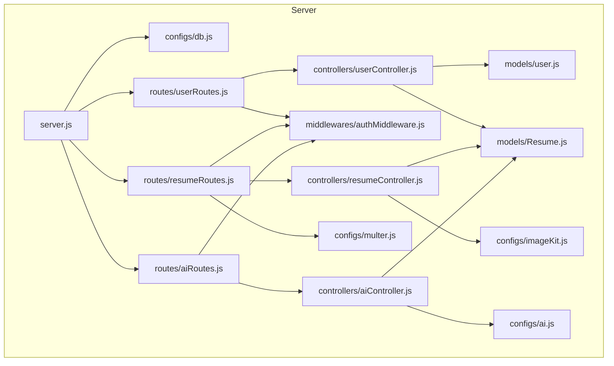

# DEVELOPER.md — CraftedCV Technical Handbook

> Written for the returning maintainer. Read this before touching the code. It explains the *why*, not just the *what*.

---

## 1. Project Overview

**CraftedCV** is a full-stack, AI-assisted resume builder. A user authenticates, creates one or more resumes through a guided multi-section form, optionally asks an LLM to rewrite specific text fields (professional summary, job descriptions), and can either export the result as a PDF (via the browser's native print pipeline) or publish a shareable public link that renders the resume with no authentication required.

**Primary purpose:** eliminate the blank-page problem of resume writing by combining structured data entry with generative AI micro-assists, and by allowing an existing PDF resume to be "reverse-imported" into the structured format via LLM extraction.

**Major capabilities:**
- Email/password auth (JWT, 7-day expiry, no refresh-token rotation).
- CRUD for resumes, each owned by exactly one user.
- Six visually distinct resume templates, all driven by a single shared data shape.
- AI text enhancement for two specific fields (summary, job description).
- AI-driven "PDF → structured resume" import (parses raw extracted PDF text into the Resume schema via a JSON-mode LLM call).
- Profile photo upload with client-side cropping and server-side transformation/hosting via ImageKit.
- Public/private visibility toggle with a dedicated, unauthenticated preview route.
- Browser-native PDF export (no server-side PDF rendering engine).

**Overall architecture:** Classic two-tier SPA + REST API.
- `client/` — Vite + React 19 SPA, Redux Toolkit for global auth state, Axios for HTTP, Tailwind v4 for styling.
- `server/` — Express 5 REST API, Mongoose/MongoDB for persistence, JWT bearer-token auth, OpenAI-compatible SDK for AI calls, ImageKit SDK for image storage/transformation.

**Design philosophy:** this is a *pragmatic, thin-layered* application, not an enterprise-layered one. There is no service layer, no repository abstraction, and no DTO/validation library on the backend. Controllers talk to Mongoose models directly. This is a deliberate (or at least consistent) simplicity trade-off appropriate for the project's scope — see [§19 Important Design Decisions](#19-important-design-decisions) and [§24 Technical Debt](#24-technical-debt) for the costs of that trade-off.

---

## 2. Repository Structure

```
craftedcv-main/
├── client/                  # React SPA (Vite)
│   └── src/
│       ├── app/              # Redux store + slices (global client state)
│       ├── assets/            # Static images + landing-page dummy data
│       ├── components/        # Reusable UI: forms, pickers, previews
│       │   ├── home/           # Landing-page-only sections
│       │   └── templates/      # Resume rendering templates (pure, presentational)
│       ├── configs/            # Axios instance (api.js)
│       ├── pages/               # Route-level components
│       └── utils/                # Small pure helpers (image cropping)
└── server/                   # Express REST API
    ├── configs/                # Third-party client singletons (db, ai, imagekit, multer)
    ├── controllers/            # Request handlers — the only "business logic" layer
    ├── middlewares/            # Cross-cutting request processing (auth)
    ├── models/                  # Mongoose schemas
    └── routes/                   # Express routers — wire URLs to controllers
```

### `client/src/app/`
**Why it exists:** Holds all *cross-page* client state. Currently this is only auth (`token`, `user`, `loading`), because that is the only piece of state multiple, unrelated routes need simultaneously (Navbar, Layout's auth gate, the Axios interceptor, and every page that calls the API).
**What belongs here:** Redux slices for state that must survive route changes and be readable outside the React tree (see `configs/api.js`, which imports the store directly).
**What should never belong here:** Per-page/per-form state (e.g., the resume being edited). `ResumeBuilder.jsx` deliberately keeps `resumeData` as local `useState`, not Redux — it's scoped to one page's lifecycle and doesn't need global visibility.

### `client/src/assets/`
**Why it exists:** Static binary assets (screenshots used on the landing page, a dummy profile picture) plus `assets.js`, which contains hardcoded example resume JSON used purely for illustrative/demo purposes on the marketing site.
**What should never belong here:** Anything imported by authenticated app pages — this folder is landing-page-only content.

### `client/src/components/`
**Why it exists:** Shared, reusable UI. Split into three tiers:
- Top-level (`ColorPicker`, `TemplateSelector`, the six `*Form.jsx` files, `ResumePreview`, `Navbar`, `Loader`) — used inside the authenticated app.
- `home/` — used only by the public marketing page (`Home.jsx`). Isolated because these components have zero data dependency on Redux/auth state beyond an optional "is logged in" check for CTA text, and are never reused inside `/app`.
- `templates/` — pure, stateless, presentational components. **Rule:** a template receives `{ data, accentColor }` and *only* renders — it must never fetch data, mutate state, or contain a form. This separation is what allows `ResumeBuilder` (live editor) and `Preview` (public read-only view) to render the exact same visual output from the exact same component tree.

### `client/src/configs/`
**Why it exists:** `api.js` is the single Axios instance for the whole app, with a request interceptor that attaches the JWT automatically. Centralizing this means no component ever manually sets an `Authorization` header from scratch when calling the API from a fresh code path — though several components (see [§23 Common Pitfalls](#23-common-pitfalls)) still do so redundantly.

### `client/src/pages/`
**Why it exists:** One file per route (see [§6 Frontend Flow](#6-frontend-flow)). These are the only components allowed to call `useParams`/`useNavigate` and orchestrate multiple child components + API calls together.

### `client/src/utils/`
**Why it exists:** Pure, framework-agnostic helper functions. Currently only `cropImage.js`, which converts a cropped canvas region into a `File` object entirely in the browser (no server round-trip needed just to crop).

### `server/configs/`
**Why it exists:** Every third-party client (MongoDB connection, OpenAI-compatible client, ImageKit client, Multer disk storage) is instantiated exactly once here and imported wherever needed. This is the Node.js equivalent of a lightweight DI container — no framework, just module-level singletons.
**What should never belong here:** Route logic or request/response handling of any kind.

### `server/controllers/`
**Why it exists:** This is where all business logic lives, split into three domains that map to the three route files: `userController` (auth + user profile), `resumeController` (CRUD on resumes), `aiController` (LLM-backed operations). There's no separate service layer — see [§19](#19-important-design-decisions).

### `server/middlewares/`
**Why it exists:** Cross-cutting concerns that must run *before* a controller, on multiple routes. Currently only `authMiddleware.js` (JWT verification). If you add e.g. request validation, rate limiting, or file-type checks, they belong here — not inlined into controllers.

### `server/models/`
**Why it exists:** Mongoose schema definitions and only the model-level instance methods that are inseparable from the schema (e.g. `User.comparePassword`). Business logic that spans multiple documents belongs in a controller, not a model method.

### `server/routes/`
**Why it exists:** Pure wiring — HTTP verb + path + middleware chain + controller function. No logic should ever live in a route file beyond that composition.

---

## 3. Architecture Overview



**Major layers:**
1. **Presentation (client pages/components)** — no direct knowledge of HTTP details beyond calling `api.<verb>()`.
2. **Transport (Axios instance)** — the only place that knows about base URLs and auth headers.
3. **API surface (Express routes)** — pure routing, no logic.
4. **Auth gate (middleware)** — the only place JWTs are verified; downstream code trusts `req.userId`.
5. **Business logic (controllers)** — validation, orchestration, and every call to the database or a third-party API.
6. **Persistence (Mongoose models)** — schema + minimal instance methods.

**Dependency direction:** strictly downward. Routes depend on controllers, controllers depend on models/configs, models depend on nothing else in the app. Nothing in `models/` or `configs/` ever imports from `controllers/` or `routes/`. This one-directional dependency graph is what makes the backend easy to reason about despite having no formal layering framework.

**Important abstractions:**
- **The Axios interceptor** is the client-side equivalent of the server's `authMiddleware` — a single choke point through which auth is applied.
- **`ResumePreview`** is the abstraction that decouples "which template is selected" from "where is this being rendered" (editor vs. public page) — see [§6](#6-frontend-flow).
- **`req.userId`**, attached by `authMiddleware`, is the implicit "current user" context threaded through every protected controller. There is no `req.user` object — only the ID — so controllers that need more than the ID (e.g. the user's name) must re-fetch the `User` document themselves.

---

## 4. Execution Flow

### Backend startup (`server/server.js`)
Sequence, in order, and why it matters:
1. `dotenv/config` is imported first — every other import that reads `process.env` (configs/ai.js, configs/db.js, etc.) depends on this having already run. This is why `configs/*.js` files are safe to read `process.env.X` at module-eval time instead of inside a function.
2. `await connectDB()` runs **before** `app.listen()`. The `await` at the top level of `server.js` is possible because `"type": "module"` is set in `package.json` (ES modules support top-level await). If the Mongo connection fails, `connectDB` only logs the error (it does **not** `process.exit`), so the server will still start and listen even with no working database — see [§23 Common Pitfalls](#23-common-pitfalls).
3. Global middleware: `express.json()` (parses JSON bodies) then `cors()` with no configuration (allows all origins — see [§16 Security](#16-security)).
4. A root health-check route (`GET /`), then the three routers are mounted under `/api/users`, `/api/resumes`, `/api/ai`.
5. `app.listen(PORT)` — `PORT` defaults to `3000` if unset.

### Frontend startup (`client/src/main.jsx` → `App.jsx`)
1. `main.jsx` wraps the app in `BrowserRouter` (outside) and Redux `Provider` (inside). Order matters only in that both must wrap `App`; neither depends on the other.
2. `App.jsx` mounts, and its `useEffect` immediately calls `getUserData()`:
   - Reads `token` from `localStorage` (not Redux — at this point Redux hasn't been hydrated yet).
   - If no token: dispatches `setLoading(false)` and stops. The app renders in "logged out" state.
   - If a token exists: calls `GET /api/users/data` (the Axios interceptor attaches the token, reading it from `localStorage` since Redux state is still `null` at this instant) — if valid, dispatches `login({ token, user })`, populating Redux. If invalid, clears `localStorage` and leaves the user logged out.
   - Either way, `setLoading(false)` runs in the `finally` block.
3. Only after this resolves does `Layout.jsx` stop showing the loading spinner and either show the real app or fall back to `<Login />`.

This means: **every full page load makes exactly one implicit auth-check request** before the protected app is usable. There is no server-side rendering or route guard redirect — the "gate" is a conditional render inside `Layout.jsx`.

---

## 5. Request Lifecycle

There is no formal validation, authorization (role), or repository layer, so the lifecycle collapses to:

```
Incoming Request
    ↓
express.json() + cors()           (global middleware, server.js)
    ↓
Router match                       (routes/*.js — path + method)
    ↓
authMiddleware (protect)           (only on protected routes)
    ↓
[multer.single("image")]           (only on resumeRoutes PUT /update)
    ↓
Controller function                (manual field-presence checks act as "validation")
    ↓
Mongoose Model call                (Resume.find / create / findOneAndUpdate, etc.)
    ↓
MongoDB
    ↓
JSON Response
```

**Stage-by-stage detail, using `PUT /api/resumes/update` (the most complex route) as the worked example:**

1. **express.json()** parses the body — but this route sends `multipart/form-data` (because it may include a file), so `express.json()` does *not* parse this body; Multer does.
2. **authMiddleware** reads the `Authorization: Bearer <token>` header, verifies it with `JWT_SECRET`, and sets `req.userId = decoded.userId`. If the header is missing/malformed or the token is invalid/expired, the request is rejected with `401` **before** Multer or the controller ever runs.
3. **`upload.single("image")`** (Multer, disk storage, no filename/size config) parses the multipart body. Text fields become `req.body.*` (as strings — this is why `resumeData` arrives as a JSON *string* that the controller must `JSON.parse`), and the file (if present) becomes `req.file`, written to a temp path on disk.
4. **`updateResume` controller**:
   - Parses `resumeData` from string to object (400 on invalid JSON).
   - Strips `_id`, `userId`, `__v`, `createdAt`, `updatedAt` from the incoming payload so a client can never overwrite these via a crafted request.
   - If `req.file` exists: streams it to ImageKit with a face-centered crop transformation, deletes the local temp file, and injects the returned CDN URL into `resumeData.personal_info.image`.
   - Calls `Resume.findOneAndUpdate({ _id: resumeId, userId }, { $set: resumeData }, ...)` — the `userId` filter is what enforces authorization: a user can only update a resume they own, even though there's no explicit "check ownership, then update" step. If no document matches (wrong ID or wrong owner), Mongoose returns `null` and the controller responds `404`.
5. **Response**: `{ message, resume: updatedResume }`.

**Authentication** is JWT-based, stateless, and identical across all protected routes (see [§7](#7-authentication--authorization)).
**Authorization** is *implicit and per-document*: nearly every query includes `userId` in its filter (`Resume.find({ userId })`, `Resume.findOneAndDelete({ userId, _id })`, etc.). There is no role/permission system — every authenticated user has full read/write access to their own resumes and nothing else.

---

## 6. Frontend Flow

### Routing (`client/src/App.jsx`)


**Key behavior:** `/app` is not protected by a router redirect (e.g. `<Navigate>`); `Layout.jsx` renders `<Login />` *in place of* the child routes when there's no authenticated user in Redux. This means the URL bar can still say `/app/builder/abc123` while a logged-out user sees the login form — a deliberate simplification, but it means deep-linking to a builder URL while logged out silently shows Login instead of "please log in to continue" messaging tied to the original destination.

**Rendering:** Pure client-side rendering (CSR) via Vite — there is no SSR/hydration step. `index.html` has a single `<div id="root">` and one script tag.

**State management:**
- **Global (Redux):** only `auth` (`token`, `user`, `loading`). See `app/features/authSlice.js`.
- **Local (`useState`):** everything else — the entire in-progress resume object in `ResumeBuilder`, form-specific UI state (modals, crop state, dropdown open/closed) in each component. There is no client-side caching layer (no React Query/SWR) — every page re-fetches on mount via `useEffect`.

**API communication:** All requests go through the single Axios instance (`configs/api.js`). Its request interceptor is the *only* mechanism most components rely on for auth — though several call sites still manually pass an `Authorization` header redundantly (harmless, but see [§20 Coding Patterns](#20-coding-patterns)).

**Component hierarchy for the core editing experience:**

`ResumeBuilder` owns the single source of truth (`resumeData` state) and passes down `data` + `onChange` pairs to each form — a controlled-component pattern repeated identically across all six form components (`EducationForm`, `ExperienceForm`, `ProjectForm`, `SkillsForm`, `PersonalInfoForm`, `ProfessionalSummaryForm`). Each form calls `onChange(newArrayOrObject)` and `ResumeBuilder` merges it into `resumeData` via its section-specific setter. This is why the six forms are structurally near-identical (add/update/remove-by-index helpers) — see [§20](#20-coding-patterns).

`ResumePreview` is rendered **twice** in the whole app with the exact same props shape: once live inside `ResumeBuilder` (editable session) and once read-only inside `Preview` (public page). This dual-use is why templates must remain pure/presentational (see [§2](#2-repository-structure)).

---

## 7. Authentication & Authorization

**Mechanism:** stateless JWT, no sessions, no cookies, no OAuth, no refresh tokens.



**Token issuance:** `generateToken()` in `userController.js` signs `{ userId }` with a **7-day** expiry. There is no refresh mechanism — after 7 days the user is silently logged out (the `/api/users/data` call on next app load will 401, clearing `localStorage`).

**Token storage:** Dual-stored — in Redux (in-memory, cleared on refresh) and in `localStorage` (persists across refreshes/tabs). Redux is the primary source read by the Axios interceptor; `localStorage` is the fallback and also what re-hydrates Redux on a fresh page load.

**Token verification (`middlewares/authMiddleware.js`):**
- Requires an `Authorization: Bearer <token>` header — any other format is rejected with `401` before `jwt.verify` is even called.
- On success, sets `req.userId = decoded.id || decoded.userId`. **Note:** `decoded.id` is dead code — the token is only ever signed with `userId`, never `id` — see [§23 Common Pitfalls](#23-common-pitfalls).
- On any verification failure (expired, malformed, wrong secret), responds `401 Unauthorized: Invalid token`.

**Authorization model:** There is no role system (no admin/user distinction). Authorization is enforced entirely by scoping database queries to `req.userId` inside each controller (e.g., `Resume.findOne({ userId, _id: resumeId })`). If a controller forgets to include `userId` in its filter, it would leak cross-user data — always double-check this when adding new resume-scoped endpoints.

**Logout:** Purely client-side — `authSlice.logout()` clears Redux state and `localStorage`. The JWT itself remains valid (server-side) until it expires; there is no token blacklist/revocation.

**Password storage:** `bcrypt.hash(password, 10)` on register. `User.comparePassword` uses `bcrypt.compareSync` (synchronous — blocks the event loop briefly; acceptable at current scale, worth revisiting under load).

---

## 8. Database Documentation

**Database:** MongoDB, accessed via Mongoose. Database name is hardcoded as `resume-builder` and appended to `MONGODB_URI` in `configs/db.js` (so the URI in `.env` should point at a cluster/host *without* a trailing database name — trailing slashes are stripped defensively).



**`User` model (`models/user.js`):**
- `name`, `email` (unique + required), `password` (required, stored as bcrypt hash).
- `timestamps: true` — automatic `createdAt`/`updatedAt`.
- **Why it exists in isolation:** kept minimal on purpose — no profile fields live here because all "profile-like" data (name, photo, contact info) that's resume-specific belongs to `personal_info` on a `Resume`, not the `User`. A user can have multiple resumes with different personal info per resume (e.g., different phone/photo per job application).

**`Resume` model (`models/Resume.js`):**
- `userId` references `User` (no `required: true` on the schema, but every controller sets it, so it's a de facto required field enforced at the application layer, not the schema layer — see [§23](#23-common-pitfalls)).
- `personal_info`, `experience[]`, `project[]`, `education[]` are all **embedded subdocuments**, not separate collections. **Why:** these are 1:1-with-the-resume, never queried independently, always read/written as a whole document — embedding avoids joins (`$lookup`) for what is fundamentally a single-page-document use case.
- `minimize: false` is set explicitly — without it, Mongoose strips empty objects (like an all-empty `personal_info: {}`) from stored documents. This is required because the frontend always expects `personal_info` to exist as an object (even if empty) to avoid `undefined` errors when rendering forms.
- `template` and `accent_color` are pure presentation metadata with no server-side meaning — the backend never reads or validates them; they only matter to the frontend's `ResumePreview` switch statement.
- No explicit indexes beyond MongoDB's automatic `_id` index and the schema-level `unique: true` on `User.email`. Given queries are always filtered by `userId` (a lookup pattern), an index on `Resume.userId` would improve read performance at scale — currently absent (see [§17 Performance](#17-performance-considerations)).

**Migrations:** None exist. There's no migration framework (no `migrate-mongo`, no custom scripts) — schema evolution currently relies on Mongoose's schema-on-read flexibility (old documents simply won't have new fields until re-saved).

---

## 9. API Documentation

Base path conventions: `/api/users`, `/api/resumes`, `/api/ai`. All protected routes require `Authorization: Bearer <token>`.

### `POST /api/users/register`
- **Purpose:** create a new account and immediately log the user in.
- **Auth:** none.
- **Request:** `{ name, email, password }` (all required — manually checked, 400 if any missing).
- **Behavior:** rejects if email already exists (400). Hashes password with bcrypt. Creates `User`. Issues JWT.
- **Response `201`:** `{ message, token, user }` (`user.password` is explicitly set to `undefined` before serialization).
- **Errors:** `400` — missing fields, duplicate email, or any DB error (all funneled through the same generic error handler shape).

### `POST /api/users/login`
- **Purpose:** authenticate an existing user.
- **Auth:** none.
- **Request:** `{ email, password }`.
- **Behavior:** looks up by email; compares password with `comparePassword` (bcrypt). Both "user not found" and "wrong password" return the identical message `"Invalid email or password"` — a deliberate anti-enumeration choice (or at least a beneficial side effect).
- **Response `200`:** `{ message, token, user }`.

### `GET /api/users/data`
- **Purpose:** validate a stored token and fetch the current user's profile. Used once per app load (see [§4](#4-execution-flow)).
- **Auth:** required.
- **Response `200`:** `{ user }` (password stripped). `404` if the user tied to a valid token was deleted from the DB after the token was issued.

### `GET /api/users/resumes`
- **Purpose:** list every resume owned by the current user (powers the Dashboard grid).
- **Auth:** required.
- **Response `200`:** `{ resumes: [...] }` — no pagination; returns all documents regardless of count (see [§17](#17-performance-considerations)).

### `POST /api/resumes/create`
- **Purpose:** create an empty (or title-only) resume shell, then the client immediately navigates into the builder for it.
- **Auth:** required.
- **Request:** `{ title }`.
- **Side effects:** one new `Resume` document with `userId` = current user, all other fields at schema defaults.
- **Response `201`:** `{ message, resume }`.

### `PUT /api/resumes/update`
- **Purpose:** the single endpoint for *every* resume mutation — saving form progress, toggling `public`, and uploading a profile photo all funnel through this one route.
- **Auth:** required.
- **Content-Type:** `multipart/form-data` (via `upload.single("image")`).
- **Request fields:** `resumeId` (string), `resumeData` (JSON-encoded string of a partial/full Resume object), `removeBackground` (optional flag, currently read into the request but **not actually used** — see [§23](#23-common-pitfalls)), `image` (optional file).
- **Behavior:** parses `resumeData`, strips protected fields (`_id`, `userId`, `__v`, timestamps), optionally uploads `image` to ImageKit (streaming from the Multer temp file, then deleting it), merges the image URL into `resumeData.personal_info.image`, and does a scoped `findOneAndUpdate({ _id: resumeId, userId }, { $set: resumeData })`.
- **Response `200`:** `{ message: "Saved successfully!", resume: updatedResume }`. `404` if the resume doesn't exist or isn't owned by the caller.
- **Side effects:** writes to MongoDB; conditionally writes to ImageKit (external network call, external storage).

### `DELETE /api/resumes/delete/:resumeId`
- **Purpose:** permanently remove a resume.
- **Auth:** required.
- **Behavior:** `findOneAndDelete({ userId, _id })` — silently "succeeds" (200) even if the resume didn't exist or belonged to someone else, since Mongoose doesn't throw on a no-op delete. The client always shows a success toast regardless.

### `GET /api/resumes/get/:resumeId`
- **Purpose:** load a resume into the builder for editing.
- **Auth:** required.
- **Validation:** manually checks `resumeId.length === 24` (a crude ObjectId-shape check; not `mongoose.Types.ObjectId.isValid`) before querying, to fail fast on obviously malformed IDs. `400` if malformed, `404` if not found or not owned by caller.

### `GET /api/resumes/public/:resumeId`
- **Purpose:** the only endpoint the public preview page (`/view/:resumeId`) calls.
- **Auth:** none — this is intentionally public.
- **Behavior:** `findOne({ public: true, _id: resumeId })` — the `public: true` filter is the entire authorization mechanism here. If a resume's owner toggles it back to private, this query stops matching immediately (no caching issue, since there is no cache).

### `POST /api/ai/enhance-pro-sum`
- **Purpose:** rewrite the professional summary.
- **Auth:** required.
- **Request:** `{ userContent }` — the client sends a pre-built prompt string (e.g. `enhance my professional summary "..."`), not just the raw summary text.
- **Behavior:** one `chat.completions.create` call with a system prompt instructing a 1–2 sentence, ATS-friendly rewrite, plain text only.
- **Response `200`:** `{ enhancedContent }`.
- **Possible errors:** any OpenAI API error (rate limit, invalid key, model not found) is caught and returned as `400` with the raw `error.message` — this leaks upstream provider error text to the client (see [§16 Security](#16-security)).

### `POST /api/ai/enhance-job-desc`
- Identical shape and behavior to the above, but the system prompt is tuned for job/experience descriptions (action verbs, quantifiable results).

### `POST /api/ai/upload-resume`
- **Purpose:** the "Upload PDF" import flow — take raw text extracted client-side from a PDF and turn it into a full structured `Resume`.
- **Auth:** required.
- **Request:** `{ resumeText, title }` — `resumeText` was already extracted from the PDF *in the browser* via `react-pdftotext` before this call is made; the server never receives or parses binary PDF data.
- **Behavior:** sends a single prompt to the LLM instructing it to extract structured JSON matching the `Resume` schema shape, using `response_format: { type: "json_object" }` (JSON mode) to constrain the output. Parses the returned JSON string, then creates a new `Resume` document by spreading the parsed fields directly (`Resume.create({ userId, title, ...parsedData })`).
- **Response:** `{ resumeId }` — note: **no explicit status code is set here** (defaults to `200`), inconsistent with every other controller in the codebase that explicitly calls `.status(...)`.
- **Trust boundary note:** the parsed LLM JSON is spread directly into `Resume.create` with no schema validation beyond whatever Mongoose casting does implicitly. A malformed or unexpected LLM response shape could throw a Mongoose validation/cast error (caught and returned as 400) but could also silently create a resume with unexpected nested shapes if the LLM output loosely matches the target format.

---

## 10. Business Logic

**Core services (represented as controller groups, since there's no separate service layer):**

- **User service (`userController.js`):** identity, credential verification, token issuance. Also owns `getUserResumes`, which is arguably resume-domain logic but lives here because it's naturally scoped by `req.userId` and mirrors the "give me everything about the current user" shape of the other two user endpoints.
- **Resume service (`resumeController.js`):** the CRUD lifecycle of a resume, plus the specialized image-upload-on-save workflow.
- **AI service (`aiController.js`):** all LLM interactions. Notably, this controller *also* writes to the database (`uploadResume` creates a `Resume`), which means it isn't purely "call the AI and return text" — it's a hybrid AI + persistence controller for exactly one of its three endpoints.

**Key assumptions baked into the business logic:**
- A resume always belongs to exactly one user; there is no sharing/collaboration model beyond the public read-only link.
- `personal_info.image` is either a string (already-uploaded CDN URL) or, transiently on the client, a `File`/`Blob` object before it's uploaded — server code never receives a raw `File`, only a multipart upload or an existing string URL.
- The `public` flag is the sole gate for external visibility — there's no expiring links, no password-protected sharing, no view analytics.
- AI enhancement operates on a single field at a time and is stateless — it has no memory of prior enhancements or the rest of the resume beyond what's stuffed into the prompt by the client.

**Important algorithm — resume ID format check:** `getResumeById` checks `resumeId.length !== 24` before querying, since valid MongoDB ObjectIds are always 24 hex characters. This is a fast-fail heuristic, not full validation (a 24-character non-hex string would pass this check and then fail inside Mongoose's cast instead).

---

## 11. Data Flow

**Example: editing and saving a resume**

```
User types in a form field (e.g. ExperienceForm)
    ↓
Form calls onChange(updatedArray) — local mutation via index-based update
    ↓
ResumeBuilder's setResumeData merges the section back into the single resumeData object (React state)
    ↓ (on "Save Progress" click)
saveResume(): structuredClone + strip _id/userId/timestamps + JSON.stringify into FormData
    ↓
Axios PUT /api/resumes/update (multipart/form-data), interceptor attaches JWT
    ↓
authMiddleware verifies JWT → req.userId
    ↓
Multer parses multipart body → req.body.resumeData (string), req.file (optional)
    ↓
updateResume controller: JSON.parse(resumeData) → strip protected fields → optional ImageKit upload → Resume.findOneAndUpdate
    ↓
MongoDB persists the merged document
    ↓
Response { resume: updatedResume } → setResumeData(data.resume) — the client re-syncs its local state to the server's canonical copy (important: this is what makes the returned image URL replace the transient File object in state)
```

**Transformation points worth noting:**
- Form → JS object: index-based array mutation, always via full-array replacement (`onChange([...newArray])`), never in-place mutation.
- JS object → wire format: `JSON.stringify` into a `FormData` field (not a JSON body), because the request may also carry a binary file.
- Wire format → JS object again: the server must `JSON.parse` the string back out — this asymmetry (object → string → object) exists solely to satisfy `multipart/form-data`'s text-only field constraint.
- Image: `File` (browser) → multipart stream → Multer temp file on server disk → streamed to ImageKit → returned CDN URL string → written into the Mongo document → returned to the client, replacing the `File` object in React state with a plain string URL.

---

## 12. State Management

**Frontend:**
- **Redux (global, cross-page):** `auth.token`, `auth.user`, `auth.loading`. This is the *only* Redux slice in the app.
- **Component-local (`useState`):** everything resume-related. `ResumeBuilder` is the single largest state owner in the client, holding the entire in-progress resume as one object tree.
- **No persistent client cache:** every page's `useEffect` re-fetches from the server on mount. Navigating away and back always re-hits the API.

**Backend:**
- **Fully stateless between requests.** No server-side sessions, no in-memory caches, no job queues. Every request's context is rebuilt from the JWT + database on every call.

**Persistent storage:**
- **`localStorage`** (client): only the raw JWT string, keyed as `"token"`. This is what survives a hard page refresh (Redux state does not).
- **MongoDB** (server): the sole system of record for users and resumes.
- **ImageKit** (external): the sole system of record for uploaded profile images — the database only stores the resulting URL, never binary image data.

**Synchronization:** There is no real-time sync (no WebSockets, no polling). The client is only ever as fresh as its last explicit fetch or its last successful save response.

---

## 13. External Services

| Service | Purpose | Integration point | Notes |
|---|---|---|---|
| **MongoDB** | Primary datastore (users, resumes) | `server/configs/db.js`, all `models/*.js` | Connection string comes from `MONGODB_URI`; app appends a hardcoded `/resume-builder` database name. |
| **OpenAI-compatible API** | AI text enhancement + resume extraction | `server/configs/ai.js`, `controllers/aiController.js` | Uses the official `openai` npm SDK, but `baseURL` and `model` are both env-configurable (`OPENAI_BASE_URL`, `OPENAI_MODEL`) — this means the backend is provider-agnostic and can point at OpenAI itself, or any OpenAI-API-compatible provider (Azure OpenAI, Groq, OpenRouter, a self-hosted vLLM endpoint, etc.). |
| **ImageKit** | Image storage + on-the-fly transformation (resize, face-centered crop) | `server/configs/imageKit.js`, `resumeController.updateResume` | Only `IMAGEKIT_PRIVATE_KEY` is actually used server-side (for the upload SDK). `IMAGEKIT_PUBLIC_KEY` and `IMAGEKIT_URL_ENDPOINT` are declared in `.env.sample` but **not referenced anywhere in the codebase** — likely leftover from an earlier client-side-upload design, or reserved for a not-yet-built feature. See [§24 Technical Debt](#24-technical-debt). |

No message queue, no Redis/cache layer, no email provider, no payment provider are present in this codebase.

---

## 14. Environment Variables

### `server/.env`
| Variable | Purpose | Used in | Required | Production impact if missing |
|---|---|---|---|---|
| `JWT_SECRET` | Signs and verifies all JWTs | `userController.js` (sign), `authMiddleware.js` (verify) | Yes | Server will throw at sign/verify time; effectively no auth works. |
| `MONGODB_URI` | MongoDB connection string (without db name/trailing slash) | `configs/db.js` | Yes | `connectDB` throws internally and only logs — **server starts anyway with no DB connection**, causing every DB-backed request to hang or error. |
| `IMAGEKIT_PUBLIC_KEY` | Declared, intended for client-facing ImageKit auth | *(unused in current code)* | No (currently dead) | None currently — flagged as technical debt. |
| `IMAGEKIT_PRIVATE_KEY` | Server-side ImageKit SDK auth | `configs/imageKit.js` | Yes, if profile photo upload is used | Uploading a profile photo during resume save will fail. |
| `IMAGEKIT_URL_ENDPOINT` | Declared, intended CDN base URL | *(unused in current code)* | No (currently dead) | None currently — flagged as technical debt. |
| `OPENAI_API_KEY` | Auth for the AI provider | `configs/ai.js` | Yes, if any AI feature is used | All three `/api/ai/*` routes fail. |
| `OPENAI_BASE_URL` | Which AI provider/endpoint to hit | `configs/ai.js` | Yes | AI calls fail or hit the wrong provider if unset/misconfigured. |
| `OPENAI_MODEL` | Which model to request | `aiController.js` (used per-call) | Yes | AI calls fail with an invalid/undefined model error. |
| `PORT` | HTTP port | `server.js` | No (defaults to `3000`) | Falls back to `3000`. |

### `client/.env`
| Variable | Purpose | Used in | Required | Production impact if missing |
|---|---|---|---|---|
| `VITE_BASE_URL` | Base URL the Axios instance targets | `configs/api.js` | Yes | All API calls go to `undefined/...`, i.e., relative to the frontend's own origin — will fail unless the API happens to be reverse-proxied on the same origin. |

---

## 15. Error Handling

**Backend pattern:** every controller wraps its body in `try/catch` and, on any thrown error, responds `res.status(400).json({ message: error.message })`. This is a **single, undifferentiated error shape** across the entire API — there is no custom error class hierarchy, no distinction between validation errors, not-found errors, and unexpected server errors (they're all `400`, even genuine `500`-class failures like a DB connection drop). Two controllers (`getResumeById`, `updateResume`) additionally `console.error` before responding, for easier server-log debugging — the rest do not log at all.

**Frontend pattern:** every API call site follows the same shape:
```js
try {
  const { data } = await api.<verb>(...);
  // success path
} catch (error) {
  toast.error(error?.response?.data?.message || error.message);
}
```
This means the backend's `error.message` (including raw third-party SDK error text from Mongoose or OpenAI) is surfaced verbatim to the end user via a toast notification. There is no error-message sanitization layer.

**Global handlers:** none. There is no Express error-handling middleware (`(err, req, res, next) => ...`) registered — every error path is handled locally inside each controller's own `try/catch`. An error thrown *outside* a controller's try block (e.g., in middleware before the controller runs, or a truly unhandled async rejection) would crash the process or hang the request, since Express 5 does auto-catch rejected promises in route handlers, but there's still no centralized fallback response formatting.

**Retries:** none, anywhere in the stack (no retry on failed AI calls, no retry on failed Mongo writes).

**Monitoring/logging:** `console.log`/`console.error` only. No structured logging, no APM, no error-tracking service (e.g. Sentry) integrated.

> **Note (sensitive topic disclosure):** none of the above touches self-harm/crisis topics; this section is purely about software error-handling architecture.

---

## 16. Security

**Authentication:** JWT bearer tokens, 7-day expiry, no revocation list. Reasonably standard for a project at this scale, but note there's no mechanism to force-invalidate a token (e.g., after a password change or suspected compromise) short of rotating `JWT_SECRET` (which would invalidate *every* user's session).

**Authorization:** per-document, filter-based (`userId` in every query) — see [§7](#7-authentication--authorization). There is no centralized authorization check function; it's re-implemented inline in every controller. A future refactor adding a new resume-scoped route must remember to include `userId` in its Mongoose filter, or it will leak other users' data.

**Input validation:** manual, ad hoc, presence-only (`if (!field) return 400`). No schema validation library (Joi, Zod, express-validator) is used anywhere. This means:
- Type coercion errors surface only as Mongoose cast errors, not clean validation messages.
- There's no length limiting, format checking (e.g., email format), or sanitization of free-text fields (resume descriptions, summaries) before they're stored or rendered.

**Sanitization / XSS:** React escapes rendered text by default (no `dangerouslySetInnerHTML` is used anywhere in the templates or forms), which mitigates the most common XSS vector for user-entered resume content. There is no additional server-side sanitization (e.g., stripping HTML tags) before storage — the browser-side escaping is the only line of defense.

**CORS:** `app.use(cors())` with **no configuration** — this allows requests from *any* origin. Combined with bearer-token (not cookie) auth, this is lower-risk than it would be with cookie-based sessions (no CSRF-via-cross-origin-cookie risk), but it does mean any website can attempt to call this API on behalf of a visitor who has a valid token *in that other site's JS context* (not applicable here since tokens live in this app's own `localStorage`/Redux, not accessible cross-origin) — the bigger practical risk is that the API is fully open to being called by any frontend, not just this one.

**CSRF:** low risk by design, since auth is a manually-attached `Authorization` header (not an automatically-sent cookie) — CSRF fundamentally relies on the browser auto-attaching credentials, which doesn't happen here.

**SQL/NoSQL injection:** Mongoose's query builder (object-based filters, not string concatenation) protects against classic NoSQL operator-injection in the common case, since request bodies aren't passed as raw un-typed filter objects directly into `find()` — filters are always constructed from named fields (`{ userId, _id: resumeId }`), not from spreading `req.body` into a query.

**Secrets:** all third-party credentials live in `.env` files (gitignored in both `client/` and `server/`), loaded via `dotenv`. `.env.sample` files document the required shape without real values.

**Error message leakage:** as noted in [§15](#15-error-handling), raw `error.message` (potentially including upstream Mongoose/OpenAI internals) is returned to the client — acceptable for a smaller/open-source project, but worth tightening before handling sensitive production data at scale.

---

## 17. Performance Considerations

**No pagination anywhere.** `GET /api/users/resumes` returns every resume a user owns in one response, and the Dashboard renders all of them in one grid. Fine at small scale; will need cursor/offset pagination if users accumulate dozens+ of resumes.

**No caching layer.** Every page load re-fetches from MongoDB; there's no Redis, no in-memory cache, no HTTP caching headers set on API responses.

**No database indexes beyond defaults.** `Resume.userId` is queried on nearly every request but has no explicit index — at current expected scale this is negligible, but it's the first thing to add if resume-list queries become slow.

**Image handling:** delegated entirely to ImageKit (both storage and on-the-fly transformation/resizing), which is itself a performance-conscious choice — the app never stores or serves large binary images directly from its own server or database.

**PDF export has no server cost at all** — `window.print()` is a pure client-side/browser operation. This is a deliberate simplicity trade-off: no headless-browser or PDF-rendering library (e.g., Puppeteer) runs on the server, at the cost of export fidelity being whatever the user's browser print engine produces.

**Client bundle:** Vite + React 19, no code-splitting/lazy-loading visible in the route definitions (`App.jsx` imports every page eagerly) — for an app this size that's a reasonable trade-off, but would be the first optimization target if the template/component set grows significantly (six templates are already imported unconditionally by `ResumePreview`, even though only one renders at a time).

**AI calls are synchronous request/response** — a slow LLM completion (enhance/upload-resume) directly extends the HTTP request duration with no timeout override, streaming, or background job pattern. For the `upload-resume` flow specifically (a larger prompt + JSON-mode generation), this is the single slowest operation in the app.

---

## 18. Dependency Graph



**Tightly coupled:** `aiController.uploadResume` is coupled to the exact shape of the `Resume` schema, because it embeds a hand-written copy of the schema shape *inside the LLM prompt string itself*. If `models/Resume.js` changes shape, this prompt must be manually updated too — there is no single source of truth shared between the two (see [§24 Technical Debt](#24-technical-debt)).

**Isolated / low-coupling modules:** `client/src/components/templates/*` — each template only depends on its own props (`data`, `accentColor`) and `lucide-react` icons; they never import each other or any app-level state. `client/src/utils/cropImage.js` is a pure function with zero app dependencies.

**Dependency direction (backend):** `routes → controllers → models/configs`, never reversed. **(client):** `pages → components → configs/app`, never reversed — no component imports a page.

---

## 19. Important Design Decisions

- **No service/repository layer on the backend.** *Inferred; high confidence.* Controllers call Mongoose models directly. This keeps the codebase small and easy to navigate for a project of this scope (three resource types, no complex cross-entity business rules), at the cost of controllers mixing HTTP concerns (status codes, request parsing) with data-access concerns. If the domain logic grows (e.g., multi-step resume scoring, team/collaboration features), extracting a service layer would pay off.

- **Bearer-token auth instead of cookie sessions.** *Inferred; high confidence.* This is what makes the completely open CORS policy relatively low-risk, and it's the natural choice for a decoupled SPA + API deployed potentially on different origins/domains (Vite frontend, separate Express backend).

- **Provider-agnostic AI client (`OPENAI_BASE_URL`/`OPENAI_MODEL` as env vars).** *Inferred; high confidence.* Rather than hardcoding to `api.openai.com`, the app treats "an OpenAI-compatible chat completions endpoint" as the abstraction, which lets an operator swap providers/models purely via environment configuration — useful for cost control or self-hosting.

- **Embedding sub-documents (`personal_info`, `experience`, etc.) instead of separate collections.** *Inferred; high confidence.* These are always read/written as part of a single resume view, never queried independently — embedding matches MongoDB's document-model strengths and avoids `$lookup` joins entirely.

- **Client-side PDF export via `window.print()` rather than server-side PDF generation.** *Inferred; high confidence.* Avoids the operational cost (memory, headless Chromium) of a server-side rendering pipeline like Puppeteer, at the cost of the exported PDF's fidelity depending on the user's browser print engine and the `@media print` CSS in `ResumePreview.jsx`.

- **Client-side PDF *text extraction* for the "Upload PDF" import flow (`react-pdftotext`), rather than uploading the binary PDF to the server.** *Inferred; medium confidence.* This avoids needing a server-side PDF-parsing library/dependency and keeps the backend's `upload-resume` endpoint to a simple text-in/JSON-out contract — the trade-off is that extraction quality depends entirely on the client-side library's ability to pull clean text out of arbitrary PDF layouts.

- **The `public` boolean + a separate unauthenticated route (`GET /api/resumes/public/:resumeId`), rather than a signed/expiring share-link token.** *Inferred; medium confidence.* Simple to implement and reason about, but means the resume's `_id` itself is the entire "secret" protecting a private resume from being guessed — acceptable given MongoDB ObjectIds aren't sequential/guessable in practice, but there's no rate-limiting or logging on this endpoint to detect enumeration attempts.

---

## 20. Coding Patterns

**Controller shape (100% consistent across the codebase):**
```js
export const someAction = async (req, res) => {
  try {
    // 1. destructure req.body / req.params / req.userId
    // 2. presence checks → 400 if missing
    // 3. one or more Mongoose calls
    // 4. res.status(2xx).json({ message, ...data })
  } catch (error) {
    return res.status(400).json({ message: error.message });
  }
};
```

**Frontend array-field forms (`EducationForm`, `ExperienceForm`, `ProjectForm` — near-identical pattern):**
```js
const addX = () => onChange([...data, blankXObject]);
const removeX = (index) => onChange(data.filter((_, i) => i !== index));
const updateX = (index, field, value) => {
  const updated = [...data];
  updated[index] = { ...updated[index], [field]: value };
  onChange(updated);
};
```
This add/update/remove-by-index triad is the established convention for any new "repeatable section" form. Follow it exactly for consistency (e.g., if a "Certifications" section is ever added).

**Naming conventions:**
- Backend: `camelCase` functions, files named after their domain (`resumeController.js`, `resumeRoutes.js`) except `models/user.js`, which is lowercase while `models/Resume.js` is capitalized — an inconsistency, not a rule (see [§23](#23-common-pitfalls)).
- Frontend: `PascalCase` for every component file and export; forms are always named `<Section>Form.jsx`; page-level components live directly in `pages/` with no further nesting.

**Error toasts:** every mutating frontend action follows `toast.success(data.message)` on success / `toast.error(error?.response?.data?.message || error.message)` on failure — this is the de facto UI error-handling convention; don't invent a new pattern (e.g., inline error banners) without a reason.

**Dependency injection:** none, in the formal sense — third-party clients in `configs/*.js` are plain module-level singletons, imported directly wherever needed. This is intentional simplicity, not an oversight; introducing a DI container would be over-engineering at this scale.

---

## 21. Project Conventions for Future Development

- **New API endpoint:** add the handler to the appropriate `controllers/*.js` file (or create a new one if it's a genuinely new domain), wire it in the matching `routes/*.js` file, and apply `protect` middleware unless the endpoint is intentionally public (mirror `getPublicResumeById`'s pattern for public reads). Always scope any resume/user query by `req.userId` unless the route is explicitly meant to be cross-user-visible.
- **New database field:** add it to the relevant Mongoose schema in `models/`. If it's AI-extractable (like the existing resume fields), also update the JSON-shape description embedded in `aiController.uploadResume`'s prompt string — these are not automatically kept in sync.
- **New validation rule:** currently, validation is inline `if (!field)` checks in controllers. If validation needs grow (formats, lengths, nested object shapes), this is the point to introduce a schema-validation library (Zod/Joi) rather than continuing to hand-roll checks — but do it consistently across all controllers at once, not just the new one, to avoid a two-pattern codebase.
- **New AI-backed feature:** follow the `enhanceProfessionalSummary`/`enhanceJobDescription` pattern — client builds the full prompt string and sends it as `userContent`; the controller stays a thin pass-through to `ai.chat.completions.create` with a task-specific system prompt. Keep prompt construction on the client for simple one-field rewrites; keep it on the server (like `uploadResume`) only when the prompt needs to embed sensitive/structural information the client shouldn't be responsible for assembling.
- **New resume template:** add a new file in `components/templates/`, following the `ClassicTemplate.jsx` contract exactly — accept only `{ data, accentColor }`, remain fully presentational (no hooks beyond pure display logic, no API calls), then register it in the `switch` inside `ResumePreview.jsx` and add its metadata (`id`, `name`, `preview`) to the `templates` array in `TemplateSelector.jsx`. These three places (new file, `ResumePreview` switch, `TemplateSelector` list) must always be updated together.
- **New "repeatable section" form** (e.g., Certifications, Languages): copy the add/update/remove-by-index pattern from `EducationForm.jsx` exactly (see [§20](#20-coding-patterns)), add the corresponding array field to the `Resume` schema, add a new entry to the `sections` array in `ResumeBuilder.jsx`, and render the new form conditionally alongside the existing `activeSection.id === "..."` blocks.
- **New global client state:** only add to Redux if the state must be read outside the React tree (like `configs/api.js` reads `auth.token`) or must survive across unrelated pages. Otherwise, keep it local to the owning page, matching the existing `resumeData`-in-`ResumeBuilder` precedent.
- **UI components belong in** `components/` (shared) or `components/home/` (landing-page-only) — never inside `pages/`. Pages orchestrate; components render.

---

## 22. Files Worth Knowing

- **`server/server.js`** — the entire backend bootstrap in ~25 lines; read this first to understand middleware order and mount points.
- **`server/middlewares/authMiddleware.js`** — every protected request passes through here; understand this before touching any auth-adjacent code.
- **`server/models/Resume.js`** — the canonical shape of a resume; every template, form, and the AI extraction prompt are all implicitly derived from this file, but not automatically kept in sync with it.
- **`client/src/configs/api.js`** — the only place the frontend knows how auth headers get attached; this is the client-side mirror of `authMiddleware.js`.
- **`client/src/app/store.js` + `app/features/authSlice.js`** — the entire global client state; small enough to read in one sitting.
- **`client/src/pages/ResumeBuilder.jsx`** — the most complex single component in the app; owns the primary state tree and orchestrates every form + the live preview + the save/upload/share/download actions.
- **`client/src/components/ResumePreview.jsx`** — the template dispatch point and the source of the `@media print` CSS that PDF export depends on.
- **`.env.sample` (both `client/` and `server/`)** — the authoritative list of required configuration; always update these when adding a new environment variable.

---

## 23. Common Pitfalls

- **`authMiddleware.js`'s `decoded.id || decoded.userId` fallback is dead code.** Tokens are only ever signed with `{ userId }` (see `generateToken` in `userController.js`), so `decoded.id` is always `undefined`. Harmless today, but misleading if you're debugging auth and assume both signing shapes are in active use.
- **`resumeController.updateResume` reads a `removeBackground` form field, but nothing in the current ImageKit upload call actually uses a background-removal transformation** — the transformation string only does `w-300,h-300,fo-face,z-0.75` (face-centered crop/zoom). A comment in the code (`"removed e-bgremove"`) confirms this was intentionally disabled at some point; the frontend still has a `removeBackground` toggle wired through `PersonalInfoForm`/`ResumeBuilder` that currently has no visible effect on the output image.
- **`Resume.userId` is not marked `required: true` in the schema**, even though every code path treats it as mandatory. A bug in a future controller that forgets to set `userId` on `Resume.create` would succeed at the database layer and silently create an "orphaned" resume no one can query (since every read is filtered by `userId`).
- **`getResumeById`'s ID validation (`resumeId.length !== 24`) is a shape check, not a real ObjectId validation** — a 24-character string of the wrong character set will pass this check and then fail deeper inside Mongoose's cast layer, surfacing as a generic `400` with a Mongoose-flavored error message rather than the intended `"Invalid Resume ID format"` message.
- **`connectDB()` swallows its own connection failure** (`catch` only logs) — the server will report itself as "running" via `app.listen` even if MongoDB is completely unreachable. Every subsequent DB-backed request will then fail (or hang, depending on the Mongoose buffering behavior) with a potentially confusing error, rather than the process failing fast at startup.
- **The `resume` variable name is reused for two different types across `Dashboard.jsx`** — a single `File` object being uploaded (`resume` state, from the "Upload PDF" flow) and, separately, a loop variable name (`allResumes.map((resume, index) => ...)`) referring to a full resume document. They don't collide in scope, but reading the file quickly can cause confusion about which `resume` is meant.
- **`models/user.js` is lowercase while `models/Resume.js` is capitalized.** Purely a naming inconsistency (both export a model correctly), but worth knowing so you don't assume a deliberate convention exists when creating a third model file.
- **`aiController.uploadResume` never sets an explicit HTTP status code**, unlike every other controller — it implicitly returns `200`. Not a bug, but an inconsistency if you're grepping for status-code patterns.
- **CORS is fully open (`cors()` with no options).** If you ever need to lock this down (e.g., before a production launch with sensitive data), remember this is a one-line change in `server.js`, but verify it doesn't break the deployed frontend's actual origin first.
- **The frontend's Axios interceptor reads the token from Redux with a `localStorage` fallback, but several individual API calls (e.g., in `Dashboard.jsx`, `ResumeBuilder.jsx`) also manually pass an explicit `Authorization` header.** This is redundant (the interceptor would have added it anyway) but not harmful — just don't assume the presence of a manual header somewhere means the interceptor isn't also running.

---

## 24. Technical Debt

- **`IMAGEKIT_PUBLIC_KEY` and `IMAGEKIT_URL_ENDPOINT` are declared in `server/.env.sample` but never referenced in any source file.** Either dead configuration left over from an earlier (possibly client-side-upload) design, or placeholders for a feature that was never finished. Worth resolving explicitly — either wire them in or remove them from the sample file to avoid confusing future setup.
- **No shared source of truth between the `Resume` Mongoose schema and the hand-written JSON-shape description embedded in the `uploadResume` AI prompt (`aiController.js`).** These two representations of "what a resume looks like" can silently drift apart as the schema evolves. A small refactor to generate the prompt's shape description from the schema itself (or at least a single shared constant) would remove an entire class of future bugs.
- **No formal validation layer.** All request validation is manual, inconsistent in strictness (some fields checked for presence only, others not checked at all — e.g., no email-format validation on registration), and mixed directly into controller logic. This is the single highest-leverage refactor if the API's surface area grows.
- **Undifferentiated error handling.** Every error, regardless of cause (bad input vs. database outage vs. third-party API failure), is returned as `400` with a raw `error.message`. A real error taxonomy (validation vs. not-found vs. upstream-service vs. internal) with distinct status codes would make both client-side handling and debugging significantly easier.
- **No automated tests anywhere in the repository** (no test runner is configured in either `package.json`, no test files present). For a project handling user auth and paid-tier-adjacent AI usage, this is the most consequential gap — any refactor currently carries full regression risk with no safety net.
- **No pagination on any list endpoint.** Low risk today, but `GET /api/users/resumes` will not scale gracefully as individual users' resume counts grow.
- **The `removeBackground` feature appears half-implemented** — UI toggle and request field exist, but the corresponding ImageKit transformation was removed from the actual upload call (see [§23](#23-common-pitfalls)). Either finish it or remove the dead UI/field to reduce confusion.
- **Six near-identical template components** (`ClassicTemplate`, `MinimalImageTemplate`, `ExecutiveTemplate`, `RightSidebarTemplate`, `CascadeTemplate`, `HalleyTemplate`) share large amounts of structurally similar JSX (the same conditional-section pattern: summary, experience, projects, education, skills) with only layout/styling differing. Extracting shared sub-components (e.g., a generic `<ExperienceSection>` that each template lays out differently) could reduce duplication, though the current approach does keep each template fully self-contained and easy to reason about in isolation — a legitimate trade-off, not an unambiguous mistake.

---

## 25. Glossary

- **Resume document** — a single MongoDB document in the `Resume` collection; the unit of everything a user creates/edits/shares. Not to be confused with the uploaded PDF file used for the "import" feature.
- **`resumeData`** — the in-memory JS object in `ResumeBuilder.jsx` representing the resume currently being edited; kept in sync with (but not identical to, until saved) the corresponding server-side `Resume` document.
- **Template** — a presentational React component (`components/templates/*`) that renders a `Resume`'s data into a specific visual layout. Distinct from the "template" env/schema field, which is just the string ID (`"classic"`, `"executive"`, etc.) selecting which component to use.
- **Public resume** — a `Resume` document with `public: true`, viewable by anyone with its ID via `/view/:resumeId`, with no authentication.
- **`protect`** — the exported name of the JWT-verification Express middleware (`authMiddleware.js`); applied to every route that requires a logged-in user.
- **Enhance (AI Enhance)** — the user-facing term for the LLM-rewrite feature applied to the professional summary or a single job description.
- **Upload Resume (import flow)** — the feature where a user uploads an existing PDF resume, its text is extracted client-side, and an LLM call converts that raw text into a new structured `Resume` document — distinct from uploading a *profile photo*, which is a separate, unrelated upload path (`updateResume`'s `image` field).

---